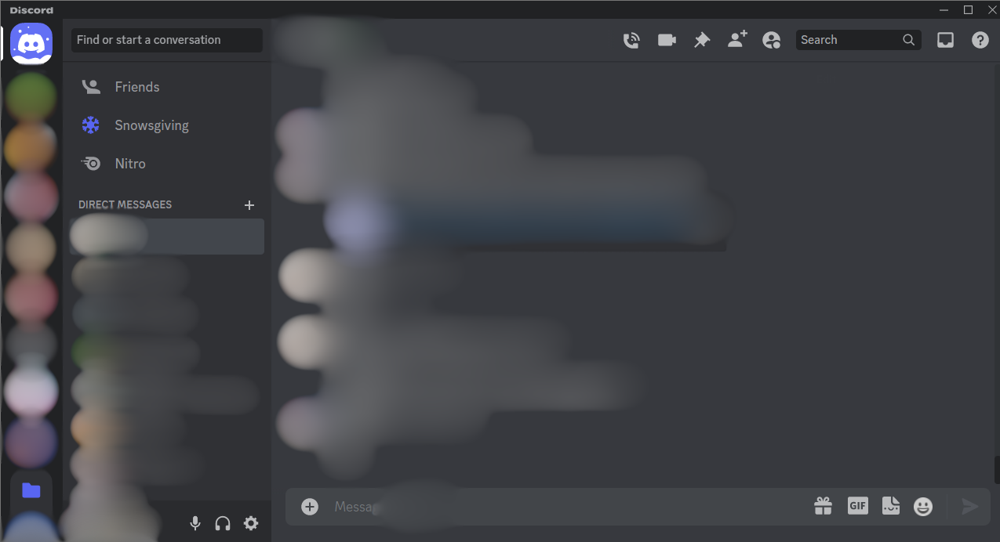
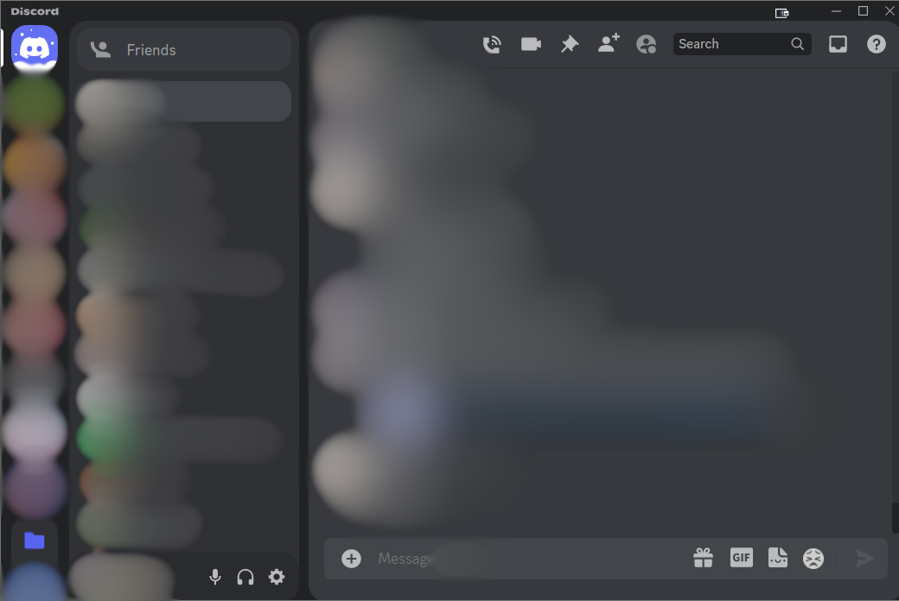

Small Discord reskin I made. Removes unnecessary elements, and rounds some corner to stay consistent with discords other design elements.

Before

After

## Installation
1. Install [OpenAsar](https://openasar.dev/).

2. Copy the contents of the main.css file into the theming section of the OpenAsar settings.
